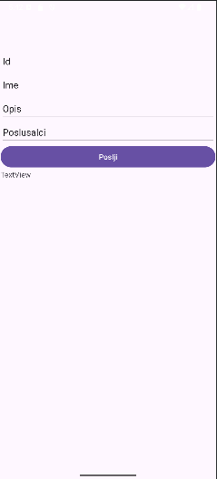

# E-muzika

## Avtorji:
- **Matija Baša** (63220014)
- **Aljaž Pogačnik** (63210256)

---

## Opis sistema:
**E-muzika** je glasbena knjižnica, kjer si lahko uporabniki ogledajo pesmi, izvajalce in albume. Sistem omogoča:
- Ustvarjanje in urejanje seznamov predvajanja.
- Personalizacijo z avtentikacijo uporabnikov.
- API za dostop do podatkov iz drugih aplikacij.

---

## Slike:

---

## Naloge posameznikov:

### **Matija Baša**
- Načrtovanje in implementacija podatkovne baze.
- Razvoj spletne aplikacije.
- Hosting aplikacije na **Microsoft Azure**.

### **Aljaž Pogačnik**
-Načrtovanje podatkovne baze.
-Razvoj mobilne aplikacije.

